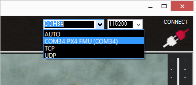
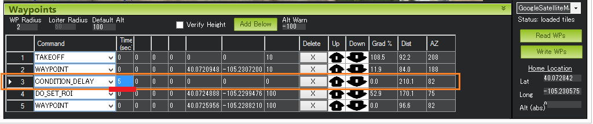
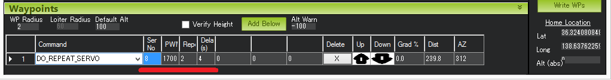
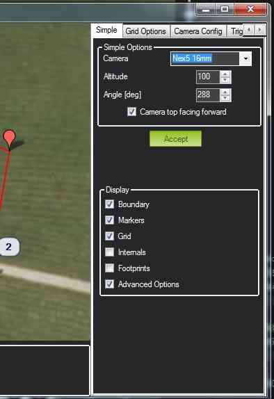
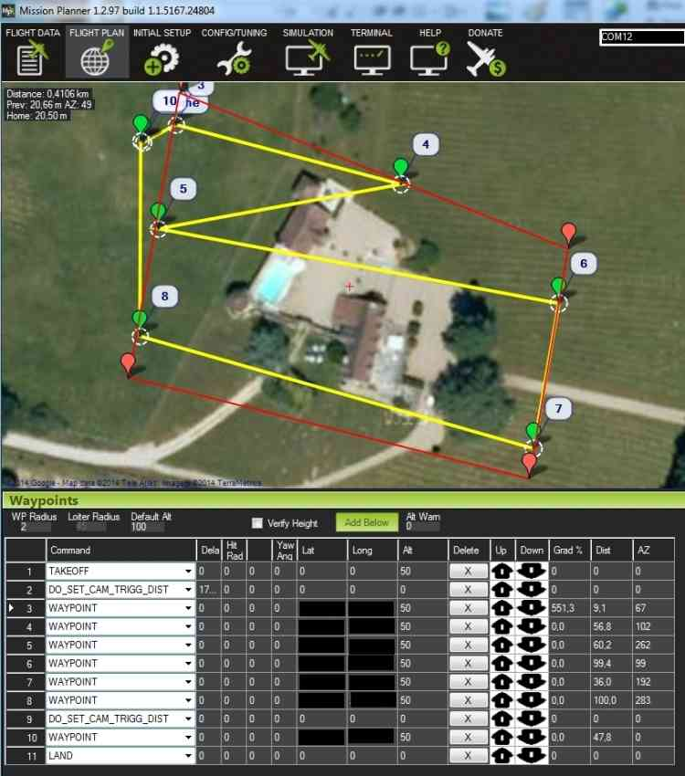
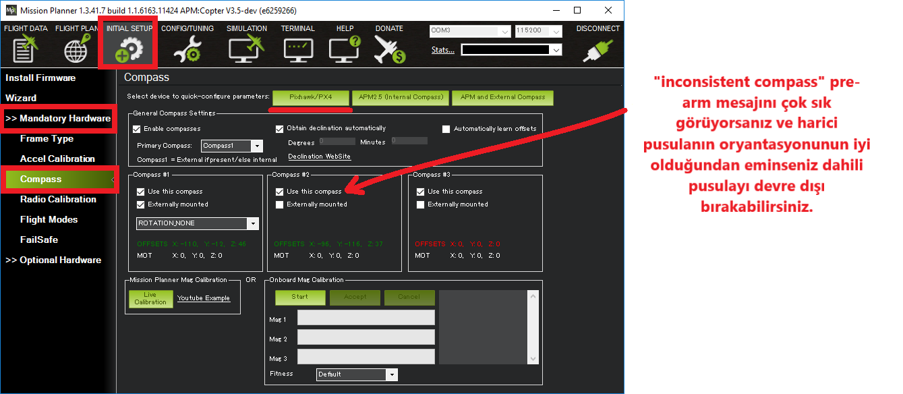

# Mission Planner Dökümantasyonu

### İÇERİK:
* [MISSION PLANNER GENEL BAKIŞ](#MISSION-PLANNER-GENEL-BAKIŞ)
    * [Mission Planner Nedir?](#Mission-Planner-Nedir?)
* [FIRMWARE YÜKLEME](#FIRMWARE-YÜKLEME)
    * [Uçuş kontrolcüsünü bilgisayara bağlayın](#Uçuş-kontrolcüsünü-bilgisayara-bağlayın)
    * [COM Port seçin](#COM-Port-seçin)
    * [Firmware'ı kur](#Firmware'ı-kur)
    * [Test etme](#Test-etme)
* [MISSION PLANNER'I OTOPİLOTA BAĞLAMA](#MISSION-PLANNER'I-OTOPİLOTA-BAĞLAMA)
    * [Bağlantı kurma](#Bağlantı-kurma)
    * [Sorun giderme](#Sorun-giderme)
* [GÖREV PLANLAMASI](#GÖREV-PLANLAMASI)
    * [Olaylar ve Waypointler ile Bir Görev Planlama](#Olaylar-ve-Waypointler-ile-Bir-Görev-Planlama)
        * [Ev konumu ayarlama](#Ev-konumu-ayarlama)
        * [Talimatlar](#Talimatlar)
        * [İpuçları](#İpuçları)
        * [Auto grid (Otomatik Izgara)](#Auto-grid-(Otomatik-Izgara))
        * [Görev komutları](#Görev-komutları)
    * [Görev Komut Listesi](#Görev-Komut-Listesi)
    * [Kamera Kontrolü ve Otomatik Görevler](#Kamera-Kontrolü-ve-Otomatik-Görevler)
    * [Rally Points (Rally Noktaları)](#Rally-Points-(Rally-Noktaları))
    * [Geotagging Images with Mission Planner (Gerekirse Bak)](#Geotagging-Images-with-Mission-Planner-(Gerekirse-Bak))
* [MISSION PLANNER ÖZELLİKLERİ/EKRANLARI](#MISSION-PLANNER-ÖZELLİKLERİ/EKRANLARI)
    * [Uçuş Verileri Ekranı (Flight Data Screen)](#Uçuş-Verileri-Ekranı-(Flight-Data-Screen))
        * [GCS Uçuş Verileri Ekranı](#GCS-Uçuş-Verileri-Ekranı)
		* [Uçuş Verileri ekranı kullanımı ipuçları](#Uçuş-Verileri-ekranı-kullanımı-ipuçları)
		* [Guided (Kılavuzlu) mod](#Guided-(Kılavuzlu)-mod)
    * [Başlangıç Ayarları (Initial Setup)](#Başlangıç-Ayarları-(Initial-Setup)) 
        * [Firmware Yükle](#Firmware-Yükle)
		* [3DR Radyo](#3DR-Radyo)
		* [Antenna Tracker](#Antenna-Tracker)
		* [Zorunlu Donanım](#Zorunlu-Donanım)
		* [Keyfi Donanım](#Keyfi-Donanım)        
    * [Simülasyon Ekranı (Simulation Screen)](#Simülasyon-Ekranı-(Simulation-Screen))    
    * [Yapılandırma ve Ayar Ekranı (Configuration and Tuning)](#Yapılandırma-ve-Ayar-Ekranı-(Configuration-and-Tuning))
    * [Pusula Kalibrasyonu (Compass)](#Pusula-Kalibrasyonu-(Compass))
        * [İlk kalibrasyon adımları](#İlk-kalibrasyon-adımları)
		* [Onboard calibration - Yerleşik kalibrasyon](#Onboard-calibration---Yerleşik-kalibrasyon)
		* [Çubuk hareketlerini kullanarak yerleşik kalibrasyon](#Çubuk-hareketlerini-kullanarak-yerleşik-kalibrasyon)
    	* [Offboard kalibrasyon (Live Calibration)](#Offboard-kalibrasyon-(Live-Calibration))
    * [İvmeölçer Kalibrasyonu (Accelerometer)](#İvmeölçer-Kalibrasyonu-(Accelerometer))
        * [Kalibrasyon adımları](#Kalibrasyon-adımları)
    * [Kumanda Kalibrasyonu (Radio Control)](#Kumanda-Kalibrasyonu-(Radio-Control))
        * [Verici yapılandırması](#Verici-yapılandırması)
		* [Kanal eşleştirmeleri](#Kanal-eşleştirmeleri)
		* [Önkoşullar](#Önkoşullar)
		* [Önce güvenlik](#Önce-güvenlik)
		* [Trimleri ortalamak](#Trimleri-ortalamak)
		* [Otopilotu bağlayın ve alıcıyı açın](#Otopilotu-bağlayın-ve-alıcıyı-açın)
		* [Kalibrasyon adımları](#Kalibrasyon-adımları)
    * [RC Verici Uçuş Modu Yapılandırması](#RC-Verici-Uçuş-Modu-Yapılandırması)
        * [Uçuş modlarınınn yapılandırılması](#Uçuş-modlarınınn-yapılandırılması)
		* [Uçuş modu kanalını ayarlama](#Uçuş-modu-kanalını-ayarlama)
		* [Verici yapılandırması](#Verici-yapılandırması)
		* [Veri switch ayarlarını test edin](#Veri-switch-ayarlarını-test-edin)
		* [Belirli RC donanımları için öğreticiler](#Belirli-RC-donanımları-için-öğreticiler)
		* [Spektrum DX8 (alternatif yöntem)](#Spektrum-DX8-(alternatif-yöntem))
    * [Uçuş Planı (Flight Plan)](#Uçuş-Planı-(Flight-Plan))
        * [Görev Planlama Detayları](#Görev-Planlama-Detayları)
    * [Uçuş Verileri (Flight Data)](#Uçuş-Verileri-(Flight-Data))
    * [Dil Tercümeleri](#Dil-Tercümeleri)
    * [Diğer Mission Planner Özellikleri](#Diğer-Mission-Planner-Özellikleri)


# MISSION PLANNER GENEL BAKIŞ


Açık kaynaklı Ardupilot projesi için tam özellikli yer kontrol istasyonu uygulamasıdır. Bu sayfa Mission Planner'in arkaplanı ve site organizasyonunu hakkında bilgi içerir.

## Mission Planner Nedir?

Plane, Copter ve Rover için yer kontrol istasyonudur. Otonom aracınız için konfügürasyon aracı veya dinamik kontrol tamamlayıcı olarak kullanılabilir.

Mission Planner ile yapabileceğiniz birkaç şey:
* Firmware'i aracınızı kontrol eden otopilot kartına yükleyin.
* Aracınızı optimum performans için ayarlayın.
* Waypointler planlayın.

 

# FIRMWARE YÜKLEME


Bu talimatlar, Mission Planner yer istasyonunu kullanarak uçuş kontrolcüsüne son firmware'ın nasıl indirileceğini gösterecek.

## Uçuş kontrolcüsünü bilgisayara bağlayın

Bilgisayara yer istasyonu kurduğunuzda uçuş kontrolcüsünü aşağıda gösterildiği gibi makro USB kablosu kullanarak bağlayın.


Windows, doğru sürücü yazılımını otomatik olarak algılayıp kurmalıdır.

## COM Port seçin

> Com Port: Veri alış verişini sağlayan kablo girişi diyebiliriz.  
> Baud Rate: Veri iletişim hızı.  
> Firmware: Aygıt yazılımı.

Görev Planlayıcı'yı kullanıyorsanız, ekranın sağ üst köşesinden kartınız için **AUTO** veya spesifik bir port seçin.  
Veri iletişim hızını 115200 olarak ayarlayın. Ama hemen Connect'e basmayın.



## Firmware'ı kur

Aracınıza uyan ikonu Mission Planner’ın Başlangıç Ayarları | Firmware Kurma ekranında seçin. "Emin misiniz?" sorusuna Evet deyin.


YKİ (yer kontrol istasyonu) hangi kartı kullandığınızı tespit ettikten sonra, kartı kablosunu çıkarmanızı isteyecek, çıkarıp TAMAM'a tıklayın ve tekrar takın (bu kısa sürede botloader yeni firmware yükleme isteklerini kabul eder).

Daha sonra "ChibiOS yüklensin mi?" sorusu gelebilir. Çoğu kullanıcı bunu nasıl yanıtladığıyla ilgili önemli bir fark görmez.

* "Evet", ArduPilot'u daha küçük ve daha verimli ancak birkaç eksik özelliğe sahip olan daha yeni ChibiOS işletim sistemi kullanarak yükleyecek.

* "Hayır", ArduPilot'u daha eski olan NuttX işletim sistemi kullanarak yükleyecek.


Her şey yolunda giderse sağ altta "erase...", "program...", "doğrulanıyor..." ve "Yükleme Tamamlandı" gibi bazı durumların yazıldığını göreceksiniz. Firmware karta başarıyla yüklendi.

## Test etme

Firmware'in çalışıp çalışmadığını, Mission Planner Uçuş Verisi ekranına geçip Bağlan düğmesine basarak test edebilirsiniz. 

# MISSION PLANNER'I OTOPİLOTA BAĞLAMA


Bu makalede, Telemetri almak ve aracı kontrol etmek için Mission Planner'ın otopilota nasıl bağlanacağı açıklanmaktadır.

## Bağlantı kurma

Bir bağlantı kurmak için önce kullanmak istediğiniz iletişim yöntemini/kanalını seçmeli, ardından fiziksel donanımı ve Windows aygıt sürücülerini kurmalısınız. PC ve otopilotu USB kabloları, Radyo Telemetriler, IP bağlantıları vs. kullanarak bağlayabilirsiniz.

**NOT:** Bağlantı donanımınızın sürücüsünün Windows'ta bulunması gerekir, çünkü bağlantınızın COM portunu ve varsayılan veri hızını Mission Planner'a sağlar.

<figure>
  
</figure>


<figure>
  
</figure>


Mission Planner'da ekranın sağ üst kısmındaki açılır kutular kullanılarak bağlantı ve veri hızı belirlenir.


USB veya Telemetri Radyosu bağladıktan sonra, Windows otomatik olarak otopilotunuza bir COM port numarası atar ve açılır menüde gösterir. (sayı önemli değil) Bağlantı için uygun veri hızı da ayarlanır (genellikle USB bağlantı veri hızı 115200 ve radyo bağlantı hızı ise 57600).

İstediğiniz portu ve hızını seçin, ardından otopilota bağlanmak için Bağlan düğmesine basın. Mission Planner bağlandıktan sonra otopilottan parametreleri indirecek.

**NOT:** "Port seç" açılır menüsünde ayrıca bir ağ üzerinden otopilota bağlanmak için kullanılabilecek TCP ve UDP port seçenekleri de bulunur.

#### Sorun giderme

Mission Planner bağlanamıyorsa:
   * Seçilen yöntem için doğru veri iletişim hızının kullanıldığını kontrol edin. (USB için 115200 veya Radyo/Telemetri için 57600)
   * Windowsta COM port kullanıyorsanız, bağlantının COM portunun Windows Aygıt Yöneticisinin seri portları listesinde olup olmadığını kontrol edin.
   * USB port kullanıyorsanız, farklı bir USB port deneyin.
   * UDP veya TCP bağlantısı kullanıyorsanız, güvenlik duvarınızın IP trafiğini engellemediğinden emin olun.
   
Ayrıca, otopilot kontrol kartınıza uygun ArduPilot firmware kurulu olduğundan ve doğru şekilde boot edildiğinden emin olun. (Pixhawkta size otopilotun durumunu söyleyen kullanışlı LEDler ve Sesler vardır)
    

# GÖREV PLANLAMASI


Bu bölüm Görev Planlaması hakkında makaleler içerir; ArduPilot AUTO moduna ayarlandığında çalışacak otomatik görevler oluşturur.

## Olaylar ve Waypointler ile Bir Görev Planlama

Bu sayfa tüm araç tipleri için genel waypoint kurulumunu açıklar.

#### Ev konumu ayarlama

Copter, Uçak ve Rover için ev konumu aracın arm edildiği konum olarak ayarlanır. Bu, RTL görevi yaptığınızda, arm edildiği yere geri dönmesi için uygun bir konuma yerleştirin veya alternatif dönüş noktası ayarlamak için toplanma noktası (rally point) kullanın.

**Video: Çoklu-waypoint Görev oluşturma ve kaydetme**: https://www.youtube.com/watch?v=HAjkuJdjZw4  
**Video: Kayıtlı Çoklu-waypoint Görevden yükleme**: https://www.youtube.com/watch?v=nBq8YHShkVU


#### Talimatlar

Aşağıdaki ekran görüntüsünde, Copter görevi 20 metre irtifaya kadar oto takeoff ile başlar; sonra WP 2'ye giderken 100 metre irtifaya yükselir, daha sonra 10 saniye bekler; daha sonra uçak WP 3'e devam eder (yolda 50 metre irtifaya iner), kalkış noktasına döner. Varsayılan irtifa 100 metre olduğundan, kalkış noktasına geri dönüş 100 metrede olacaktır. Kalkış noktasına ulaştıktan sonra, uçak iniş yapar. Görev, kalkış pozisyonunun ev konumunda olduğunu varsayar.


Waypointleri ve diğer komutları girebilirsiniz (daha fazla bilgi için Görev komutları bölümüne bakın). Satırlardaki açılır menüden istediğiniz komutu seçin. Sütun başlıkları, hangi komutun ne gerektirdiğini size göstermek için değişecektir. Haritaya tıklayarak Latitude ve Longitude girilebilir. İrtifa(altitude), kalkış yüksekliğine/ev konumuna göre değişir, bu nedenle 100m ayarlarsanız 100m üstünüzden uçacak.

Varsayılan Alt, yeni waypointler girerken varsayılan irtifadır. Aynı zamanda **Hold Default ALT** seçtiyseniz RTL modunun uçacağı irtifadır; seçmediyse uçağınız RTL'i açtığınız zamanki irtifayı korumaya çalışacaktır.

**Verify height** Mission Planner'ın her waypointde istediğiniz irtifayı ayarlamak için Google Earth topoloji verilerini kullanacağı anlamına gelir. 

Görevinizi tamamladığınızda, **Write**'ı seçin, APM'ye gönderilir ve EEPROM'a kaydedilir. **Read**'i seçerek istediğiniz gibi olduğunu onaylayabilirsiniz.
**Save WP File**'ı seçerek birden fazla görev dosyasını bilgisayarınıza kaydedebilir veya sağ tık menüsünden **Load WP File** ile dosyaları okuyabilirsiniz.

#### İpuçları

- <mark>Ön belleğe alma</mark>: Harita verilerini önbelleğe alabilirsiniz. Böylece internet olmadığı yerlerdede kullanabilirsiniz. Haritaya sağ tıklayıp **Map Tool -> Prefetch** seçeneğine tıklayın. Belli bir konumu indirmek için öncesinde **Alt** tuşuna basarak alanı kutu içine alın.

- <mark>Grid (Izgara)</mark>: Bir poligon çizmenize (sağ klik->draw polygon) ve seçilen alan üzerine otomatik olarak waypointler oluşturmanıza olanak sağlar. Alan çizildikten sonra Auto WP seçeneği ile alana otomatik wp konulabilir.

- Ev konumunuzu geçerli konuma ayarlamak için ev konumunuzu belirlemek istediğiniz yere sağ tıklayıp **Set Home Here** seçeneğini seçin. Ayrıyetten sağ alttaki Home Location kısmındanda ayarlayabilirsiniz.

- İki nokta arasındaki mesafeyi ölçmek için bir ucuna sağ tıklayıp **Measure Distance** seçin. Diğer ucuna sağ tıklayın ve tekrar **Measure Distance** seçeneğini seçin. Bir iletişim kutusunda gösterilecek.

#### Auto grid (Otomatik Izgara)

Ayrıca Mission Planner'ın bir görev oluşturmasını sağlayabilirsiniz; bu da uçağın fotoğraf toplamak için bir alanda "çim biçme makinesi" şeklinde ileri geri gitmesi gereken harita görevleri gibi işlevler için kullanışlıdır.  

Bunu yapmak için sağ tık mensünde Polygon seçin ve istediğiniz alanın çevresine bir kutu çizin. Ardından Auto WP, Grid seçin. İrtifa ve aralıkları seçmek için iletişim kutusu işlemini takip edin. Mission Planner şöyle bir görev üretecektir:


#### Görev komutları

Mission Planner, mevcut araç tipine uygun komutların filtrelenmiş bir listesini sunar ve kullanıcı tarafından sağlanan değerleri ilgilendiren parametreler için sütun başlıkları ekler. Bunlar, civardaki waypointlere ve loiterlere seyahat etmek için gezinme komutlarını, belirli eylemleri gerçekleştirmek için DO komutlarını (örn. fotoğraf çekmek) ve DO komutlarının ne zaman gerçekleşeceğini kontrol eden durum komutlarını içerir.


Örnek: LOITER_TURNS, bir konumun etrafında dolaşmak için dönüş sayısı (turn), yön (direction) ve konum (location) başlıklarını içeren komut.

Tüm ArduPilot platformları tarafından desteklenen görev komutlarının tamamı [MAVLink Görev Komutu Mesajlarında (MAV_CMD)](http://ardupilot.org/planner/docs/common-mavlink-mission-command-messages-mav_cmd.html) listelenmiştir. Bu her bir komutun tam adını, hangi parametreleri desteklediğini ve buna karşılık gelen Mission Planner sütun başlıklarını içerir.

Mission Planner tam komut adlarının kısaltılmışını kullanır. Örneğin, MAV_CMD_NAV_WAYPOINT, MAV_CMD_CONDITION_DISTANCE, MAV_CMD_DO_SET_SERVO gibi komutlar, MP'de WAYPOINT, CONDITION_DISTANCE ve DO_SET_SERVO olarak listelenmiştir.

**How to prefetch a stored Mission Map**: https://www.youtube.com/watch?v=1s8gsXTdPY8  
**Occasionally You will see some really big Numbers**: https://www.youtube.com/watch?v=J5ClTnggZKk

## Görev Komut Listesi

Bu makalede, Auto moda geçildiğinde Plane tarafından desteklenen görev komutları açıklanmaktadır. Bu devam eden bir çalışmadır, tam olarak incelenmemiştir.

#### Komut Türleri

- Navigasyon komutları, kalkış, waypointlere gidip gelme, irtifa değiştirme ve iniş gibi araç hareketlerini kontrol eder. 

- DO komutları, yardımcı fonksiyonlar içindir ve aracın konumunu etkilemez (örneğin kamera tetiklenme mesafesi, servo değeri ayarlama).

- Koşul komutları, DO komutlarını koşul yerine getirilinceye kadar geciktirmek için kullanılır; örn. İHA belirli bir yüksekliğe veya mesafeye ulaşıncaya kadar.

Görev sırasında tek seferde en fazla bir “Navigasyon” komutu ve bir “Do” veya “Koşul” komutu çalıştırılabilir. 

NOT: CONDITION ve DO komutları önceki NAV komutuyla ilişkilendirilir: UAV bu komutlar uygulanmadan önce yol noktasına ulaşırsa, bir sonraki NAV komutu yüklenir ve atlanırlar.

#### Navigasyon komutları

Navigasyon komutları, kalkış, iniş, araç hareket kontrolü için kullanılır. NAV komutları en yüksek önceliğe sahiptir. Bir NAV komutu yüklenince çalıştırılmayan DO_ ve CONDITION_ komutları atlanır.

| KOMUT ADI 	| KOMUT AÇIKLAMASI 	|
|----------------------	|-------------------------------------------------------------------------------------------------------------------------	|
| MAV_CMD_NAV_WAYPOINT 	| Belirtilen konuma git. 	|
| MAV_CMD_NAV_TAKEOFF 	| Kalkış(yerden veya elden). Tüm uçak görevlerinin ilk emri olmalıdır.|
| MAV_CMD_NAV_LOITER_UNLIM 	| Süresiz olarak belirlenen konumda dolaş(loiter). 	|
| MAV_CMD_NAV_LOITER_TURNS 	| Belirtilen konumda belirtilen tur kadar dolaş. 	|
| MAV_CMD_NAV_LOITER_TIME 	| Belirtilen konumda belirli bir süre (saniye olarak) dolaş. 	|
| MAV_CMD_NAV_RETURN_TO_LAUNCH 	| Ev konumuna veya daha yakınsa en yakın Rally Point'e geri dön. Ev konumu aracın en son arm yapıldığı yerdir. 	|
| MAV_CMD_NAV_LAND 	| Aracı geçerli konuma veya belirtilen bir konuma indir. 	|
| MAV_CMD_NAV_CONTINUE_AND_CHANGE_ALT 	| Şu anki rotaya devam edin ve belirtilen yüksekliğe tırmanın/inin. İstenilen yüksekliğe ulaşılınca diğer komuta geçilir.	|
| MAV_CMD_NAV_ALTITUDE_WAIT 	| Yükseklik veya aşağı dikey hızda beklemek için görev komutu. 	|
| MAV_CMD_NAV_LOITER_TO_ALT 	| Belirtilen Enlem ve Boylamda loiter'a başla. Lat==Lon=0 ise, geçerli konumda loiter yap. Yüksekliğe ulaşana kadar navigasyon komutunun tamamlandığını düşünmeyin (loiter'i bırakmayın). Ayrıyetten, Heading Required parametresi 0 değilse uçak bir sonraki waypointe gidene kadar loiter'den ayrılmaz.
| MAV_CMD_DO_JUMP 	| Görev listesinde belirtilen komuta atlayın. Atlama komutu, göreve devam etmeden önce belirtilen sayıda tekrar edebilir veya süresiz olarak tekrarlanabilir. En fazla 15 tekrardır. İsminin aksine NAV komutudur. |

<mark>DO_JUMP Parametreleri:</mark>

| KOMUT ALANI 	| PARAMETRE ADI 	| AÇIKLAMA 	|
|-------------	|---------------	|-------------------------------------------------------------------------------------------------------------------	|
| param1 	| WP# 	| Atlanacak komutun komut sıra numarası. 	|
| param2 	| Repeat# 	| Bir sonraki sıralı komuta geçmeden önce DO_JUMP komutunun çalıştırma sayısı. -1 ise süresiz olarak tekrar edilir. 	|


Örnekte, araç #1 ve #2 waypointleri arasında toplam 3 kez ileri geri uçar.

#### Koşul komutları

Koşul komutları, _DO_ komutlarının yürütülmesini kontrol eder. Komutların zaman gecikmesine bağlı olarak çalıştırabilir. Gecikme zamanlayıcı tamamlanmadan önce araç bir sonraki waypoint'e ulaşırsa DO komutları tetiklenmez.

| KOMUT ADI 	| AÇIKLAMA 	|
|----------------------------	|------------------------------------------------------------------------------------------------------------------	|
| MAV_CMD_CONDITION_DELAY 	| Bir waypointe ulaştıktan sonra, belirtilen koşul saniye kadar sonraki "_DO_" komutunun yürütülmesini geciktirir. 	|
| MAV_CMD_CONDITION_DISTANCE 	| Bir sonraki "_DO_" komutunun başlangıcını, araç bir sonraki waypoint'in belirtilen metre sayısı içinde oluncaya kadar geciktirir. 	|
| MAV_CMD_CONDITION_YAW | Aracın burnunu (yaw) belirtilen yöne doğru tutar.

<mark>CONDITION_DELAY Parametreleri:</mark>

| KOMUT ALANI 	| PARAMETRE ADI 	| AÇIKLAMA 	|
|-------------	|---------------	|-------------------------------------------------------------------------------------------------------------------	|
| param1 	| Time(sec) 	| Saniye olarak gecikme. 	|


Örnekte, Komut #4 geciktirilir, böylece araç Waypoint #2'yi geçtikten 5 saniye sonra başlar.

<mark>CONDITION_DISTANCE Parametreleri:</mark>

| KOMUT ALANI 	| PARAMETRE ADI 	| AÇIKLAMA 	|
|-------------	|---------------	|-------------------------------------------------------------------------------------------------------------------	|
| param1 	| Dist (m) 	| DO komutları uygulanmadan önceki bir sonraki waypointe olan mesafe. 	|


Örnekte, Komut #4 geciktirilir, böylece araç yalnızca waypoint #5'in 50 m içinde olduğunda çalışır.

#### DO komutları

Bazı işlemleri yapmak için "DO" VEYA "Now" komutları bir kez çalıştırılır.

| KOMUT ADI 	| AÇIKLAMA 	|
|-------------------------------	|--------------------------------------------------------------------------------------------------------------------------------------------------------------------------------------------------------------------------------------------------------------------------------------------------------------------------------------------------	|
| MAV_CMD_DO_SET_MODE 	| Sistem modunu ayarlar (ön uçuş, armed, disarmed vb.) 	|
| MAV_CMD_DO_CHANGE_SPEED 	| Hedef yatay hızını değiştirir. Değişiklikler, açıkça tekrar değiştirilinceye veya cihaz yeniden başlatılıncaya kadar kullanılacaktır. 	|
| MAV_CMD_DO_SET_HOME 	| Ev konumunu geçerli konum olarak veya komutta belirtilen konumda ayarlar. 	|
| MAV_CMD_DO_SET_RELAY 	| Röle pininin voltajını yüksek (açık) veya düşük (kapalı) olarak ayarlayın. 	|
| MAV_CMD_DO_REPEAT_RELAY 	| Röle pininin voltajını / durumunu, belirli bir süre boyunca belirtilen sayıda değiştirir. Rölenin değiştirilmesi bir kapatma rölesini açar ve tersi olur. 	|
| MAV_CMD_DO_SET_SERVO 	| Verilen bir servo pin çıkışını belirli bir PWM değerine ayarlar. 	|
| MAV_CMD_DO_REPEAT_SERVO 	| Bir servo PWM çıkış pimini belirli bir döngü sayısı için ve belirli bir süre boyunca, orta konum değeri ile belirtilen PWM değeri arasında döndürür.  Orta konum değeri, kanal için RCn_TRIM parametresinde belirtilmiştir (aşağıdaki ekran görüntüsünde RC8_TRIM). Varsayılan değer 1500. 	|
| MAV_CMD_DO_LAND_START 	| İnişe hazırlanmak için görev komutu. 	|
| MAV_CMD_DO_SET_ROI 	| Bir sensör seti veya aracın kendisi için ilgilenilen bölgeyi (ROI) ayarlar. Bu daha sonra, araç tutumu ve kameralar gibi çeşitli sensörlerin tutumu kontrol etmek için araç kontrol sistemi tarafından kullanılabilir. 	|
| MAV_CMD_DO_DIGICAM_CONFIGURE 	| Yerleşik bir kamera kontrol sistemi yapılandırın.   Parametreler varsa kameradaki yerleşik kamera kontrol sistemine (3DR Kamera Kontrol Kartı gibi) iletilir. 	|
| MAV_CMD_DO_DIGICAM_CONTROL 	| AC3.3: Yerleşik kamera kontrol sistemini kontrol edin (3DR Kamera Kontrol Kartı gibi). 	|
| MAV_CMD_DO_MOUNT_CONTROL 	| Bir kamera veya anten montajını kontrol etmek için görev komutu.  Bu komut, [kamera gimbalına](http://ardupilot.org/rover/docs/common-cameras-and-gimbals.html#common-cameras-and-gimbals) gönderilecek roll, pitch ve yaw açısı belirlemenizi sağlar. Bu, kamerayı görevde çeşitli zamanlarda belirli yönlere yönlendirmek için kullanılabilir. 	|
| MAV_CMD_DO_SET_CAM_TRIGG_DIST 	| [Kamera deklanşörünü](http://ardupilot.org/rover/docs/common-camera-shutter-with-servo.html#common-camera-shutter-with-servo) düzenli aralıklarla tetikleyin. Bu komut, kamera bakış görevlerinde kullanışlıdır. 	|
| MAV_CMD_DO_FENCE_ENABLE 	| GeoFence'ı etkinleştirir. 	|
| MAV_CMD_DO_INVERTED_FLIGHT 	| Inverted flight'dan çık/'a geç. 	|
| MAV_CMD_DO_AUTOTUNE_ENABLE 	| Autotune etkinleştir/devre dışı bırak. 	|

<mark>MAV_CMD_DO_SET_MODE Parametreleri:</mark>

| KOMUT ALANI 	| PARAMETRE ADI 	| AÇIKLAMA 	|
|-------------	|---------------	|-------------------------------------------------------------------------------------------------------------------	|
| param1 	| - 	| Mod, `MAV_MODE `__ tarafından tanımlandığı gibi. 	|
| param3 	| -	| Boş 	|

<mark>MAV_CMD_DO_SET_HOME Parametreleri:</mark>

| KOMUT ALANI 	| PARAMETRE ADI 	| AÇIKLAMA 	|
|-------------	|---------------	|-------------------------------------------------------------------------------------------------------------------	|
| param1 	| Current 	| Ev konumunu ayarla: 1= Ev konumunu geçerli konum olarak ayarla. 0= Mesaj parametrelerinde belirtilen konumu kullan.	|
| param5 	| Lat	| Hedef ev enlemi(eğer "param1=2")|
| param6 	| Lon	| Hedef ev boylamı(eğer "param1=2") 	|
| param7 	| Alt	| Hedef ev irtifası(eğer "param1=2") 	|

<mark>MAV_CMD_DO_SET_MODE Parametreleri:</mark>

| KOMUT ALANI 	| PARAMETRE ADI 	| AÇIKLAMA 	|
|-------------	|---------------	|-------------------------------------------------------------------------------------------------------------------	|
| param1 	| - 	| Mod, `MAV_MODE `__ tarafından tanımlandığı gibi. 	|
| param3 	| -	| Boş 	|

<mark>MAV_CMD_DO_SET_RELAY Parametreleri:</mark>

| KOMUT ALANI 	| PARAMETRE ADI 	| AÇIKLAMA 	|
|-------------	|---------------	|-------------------------------------------------------------------------------------------------------------------	|
| param1 	| Relay No 	| Röle numarası.	|
| param2 	| off(0)/on(1)	| Röle durumunu ayarla: 1: Röleyi high/on ayarla. 0: Röleyi low/off ayarla.|

<mark>MAV_CMD_DO_REPEAT_RELAY Parametreleri:</mark>

| KOMUT ALANI   | PARAMETRE ADI     | AÇIKLAMA  |
|-------------  |---------------    |-------------------------------------------------------------------------------------------------------------------    |
| param1    | Relay No  | Röle numarası.    |
| param2    | Repeat#  | Döngü sayısı - rölenin kaç kez geçiş yapması gerektiği.|
| param3   | Delay(s)  | Döngü süresi(saniye) - her geçiş arasında geçen süre.    |


Örnekte, rölenin başlayacağını varsayarsak, high ayarlanır ve 3 saniye sonra tekrar low duruma geçer.

<mark>MAV_CMD_DO_SET_SERVO Parametreleri:</mark>

| KOMUT ALANI   | PARAMETRE ADI     | AÇIKLAMA  |
|-------------  |---------------    |-------------------------------------------------------------------------------------------------------------------    |
| param1    | Ser No  | Servo numarası-hedef servo çıkış pini/kanal numarası.    |
| param2    | PWM  | Çıktı için PWM değeri, mikrosaniye olarak (genellikle 1000  2000 arası).|


Örnekte, çıkış kanalı 8'e bağlı servo PWM 1700'e getirilir (servolar genellikle 1000 ila 2000 arasında PWM değerlerini kabul eder).

<mark>MAV_CMD_DO_REPEAT_SERVO Parametreleri:</mark>

| KOMUT ALANI   | PARAMETRE ADI     | AÇIKLAMA  |
|-------------  |---------------    |-------------------------------------------------------------------------------------------------------------------    |
| param1    | Ser No  | Servo numarası-hedef servo çıkış pini/kanalı.    |
| param2    | PWM  | Çıktı için PWM değeri, mikrosaniye olarak (genellikle 1000  2000 arası).|
| param3    | Repeat #	  | Döngü sayısı - servoyu belirtilen PWM değerine getirmek için süre.|
| param4    | Delay(s)	  | Döngü süresi(saniye) - her servo hareketi arasındaki gecikme.|


Örnekte, çıkış kanalı 8'e bağlı servo PWM 1700'e getirilir, daha sonra 4 saniye sonra tekrar mide döner, 4 saniye sonra tekrar 1700'e taşınır, sonra 4 saniye sonra tekrar mide döner.

<mark>MAV_CMD_DO_DIGICAM_CONFIGURE Parametreleri:</mark>

| KOMUT ALANI   | PARAMETRE ADI     | AÇIKLAMA  |
|-------------  |---------------    |-------------------------------------------------------------------------------------------------------------------    |
| param1    | Mode  | Kamera modu ayarla: 1:ProgramAuto 2:Aperture Priority 3:Shutter Priority 4:Manual 5:IntelligentAuto 6:SuperiorAuto.    |
| param2    | Shutter Speed  | Deklanşör hızı (1/saniye). Yani hız 1/60 saniye ise girilen değer 60 olmalı. Desteklenen en yavaş hız ise 1 saniyedir.|
| param3    | Aperture	  | Açıklık: F durma numarası.|
| param4    | ISO	  | ISO numarası örn. 80, 100, 200 vb.|
| param7    | Engine Cut-Off		  | Kamera tetiklenmeden önce ana motorun kesim süresi saniye/10 (0, kesme yok demek.|

<mark>MAV_CMD_DO_DIGICAM_CONTROL Parametreleri:</mark>

| KOMUT ALANI   | PARAMETRE ADI     | AÇIKLAMA  |
|-------------  |---------------    |-------------------------------------------------------------------------------------------------------------------    |
| param1    | On/Off  | Session control(açık/kapalı veya lens göster/gizle: 0:Kamerayı kapat/lensi gizle 1: Kamerayı aç/lensi göster.    |
| param4    | Focus Lock	  | Odak Kilitleme, Odak bozma veya yeniden odaklama: 0:Yoksay 1:Kilit Aç 2:Kilitle.|
| param5    | Shutter Cmd	  | Çekim Komutu. Sıfır hariç herhangi deer kamerayı tetikler.|

<mark>MAV_CMD_DO_MOUNT_CONTROL Parametreleri:</mark>

| KOMUT ALANI   | PARAMETRE ADI     | AÇIKLAMA  |
|-------------  |---------------    |-------------------------------------------------------------------------------------------------------------------    |
| param1    | - | Pitch, derece cinsinden.    |
| param2    | - | Roll, derece cinsinden.|
| param3    | - | Yaw, derece cinsinden.|
| param7    | - | `MAV_MOUNT_MODE` __ enum değeri.|

<mark>MAV_CMD_DO_SET_CAM_TRIGG_DIST Parametreleri:</mark>

| KOMUT ALANI   | PARAMETRE ADI     | AÇIKLAMA  |
|-------------  |---------------    |-------------------------------------------------------------------------------------------------------------------    |
| param1    | Dist (m) | Kamera tetikleme mesafesi aralığı. Mesafe tetiklemeyi kapatmak için 0.|


Yukarıdaki konfigurasyon, kamera deklanşörünün aracın hareket ettiği her 5 metreden sonra tetiklenmesine neden olur.

## Kamera Kontrolü ve Otomatik Görevler

Bu makalede, ArduPilot’un kamera ve gimbal komutları açıklanmakta ve bunların kamera çekim görevlerini tanımlamak için Mission Planner'da nasıl kullanılabileceği açıklanmaktadır.

##### Kamera komutları
- <mark>DO_SET_CAM_TRIGG_DIST</mark>:  Kamera deklanşörünü düzenli aralıklarla tetikler. Bu, en çok alan araştırmalarını desteklemek için kullanılır.
- <mark>DO_DIGICAM_CONTROL</mark>:  Bu komut her çağırıldığında kamera deklanşörünü bir kez tetikleyin. 
 
##### Kamera gimbal komutları

Kamera gimbal kullanılırsa, kamera konumunu (yaw, tilt, roll) ayarlayabilir veya belirli bir ilgi alanına (ROI) yönlendirebilirsiniz:
- <mark>DO_SET_ROI</mark>:  Kamerayı belirtilen bir ilgi alanına doğru hedefleyin (konum, irtifa dahil).
- <mark>DO_MOUNT_CONTROL </mark>:  Gimbalı belirtilen roll, pitch ve yaw ile yerleştirin.

##### Servo ve röle komutları
Servolar ve röle çıkışları donanıma bağlanabilir ve sırasıyla DO_SET_SERVO veya DO_SET_RELAY komutlarını kullanarak görevler sırasında etkinleştirilebilir.

Bu çıkışlar için olası bir kullanım, deklanşör dışındaki kamera özelliklerini kontrol etmektir (örneğin, zoom seviyesini ayarlamak veya çekimi fotoğraftan videoya geçirmek).

##### Otomatik görev türleri
Mission Planner aşağıdaki Auto Waypoint seçeneklerini destekler. Bunlara erişmek için Flight Plan ekranını açın, haritaya sağ tıklayın ve Auto WP menüsü altındaki seçeneği seçin: 

- **Create WP Circle** — Waypoint çemberi oluşturur.
- **Area**  — Geçerli poligonun alanını görüntüler (tanımlanmışsa).
- **Create Spline Circle** — Waypoint'lerin irtifasının yükselen bir eğriyi takip ettiği daire. 
- **Survey (Grid)** — Belirli bir poligonu araştırmak için otomatik olarak waypointleri ve kamera kontrol komutlarını oluşturur.
- **Survey (Gridv2)** — Yapım aşamasında! Bu dikdörtgen bir araştırma alanı oluşturmak için daha basit bir ızgara kontrolüdür.
- **SimpleGrid** — Basit bir otomatik oluşturulan araştırma ızgarası. Kamera kontrolü tanımlanmaz, bu yüzden ayrı olarak eklenmelidir.

#### Araştırma (grid) örneği

Mission Planner'in Survey(Grid) seçeneği, rastgele bir çokgeni örten wpleri otomatik olarak tanımlar ve aracın yolunda resimlerin düzenli aralıklarla çekilmesini sağlamak için DO_SET_CAM_TRIGG_DIST'i ilgili wplere ayarlar.

- Fligh Plan sekmesini açın.
- Haritaya **sağ tıklayın** ve **Draw Polygon | Add PolyGon Point** seçeneğini seçin. Fotoğrafı çekilecek olan alanı çevreleyen noktalar oluşturur.
- Haritaya yeniden **sağ tıklayın** ve **Auto WP | Survey(Grid)** seçeneğini seçin.


- Mission Planner daha sonra kamerayla ilgili parametreleri tanımlayabileceğiniz konfigürasyon ekranı görüntüler. <mark>DO_SET_CAM_TRIGG_DIST</mark> bu bilgilere göre otomatik olarak hesaplanır!



- **Accept** tıkladıktan sonra, Mission Planner, belirtilen alanı kapsayan, kalkış ve iniş waypointleri dahil olmak üzere waypoint listesi oluşturacak. Görev sırasında iki kamera tetikleyicisi arasındaki mesafeyi metre cinsinden ayarlamak için <mark>DO_SET_CAM_TRIGG_DIST</mark> komutu çağrılır. Görev sonunda, <mark>DO_SET_CAM_TRIGG_DIST</mark> parametreyi sıfıra(fotoğraf almayı durdurur) ayarlamak için tekrar çağrılır.

Son görev şöyle görülür:



Bu test görevi yürütüldü. Birleştirilmek üzere 15 görüntü üretti. Bileşik görüntünün küçük hali aşağıda gösterilmiştir (tam boyutu 107 MB).


Gelişmiş rehber için: http://ardupilot.org/rover/docs/common-pixhawk-auto-camera-trigger-without-chdk.html#common-pixhawk-auto-camera-trigger-without-chdk

#### Kompozit resimler oluşturmak

Bunun için piyasada çok sayıda ücretsiz ve ücretli program bulunmaktadır:
- [Pix4Dmapper](https://www.pix4d.com/)
- [Microsoft Image Composite Editor (ICE)](https://www.microsoft.com/en-us/research/product/computational-photography-applications/image-composite-editor/?from=http%3A%2F%2Fresearch.microsoft.com%2Fen-us%2Fum%2Fredmond%2Fprojects%2Fice%2F)

## Rally Points (Rally Noktaları)


Normalde uçak RTL moduna girdiğinde (genelde autopilot failsafe modu tetiklendiğinde), varsayılan davranış Ev konumuna geri dönmektir. Ancak bunun istenmediği durumlar olabilir. Örneğin, burası insanlarla dolu bir alan olabilir RTL modu ile iniş sorun yaratabilir.

Bu nedenle bir Rally Points tanımlanması durumunda Ev konumu yerine en yakın Rally Pointe ilerleyecektir. Uçak o konumda loiter yapacaktır.

#### Rally Points Ayarlama

1. Rally Point enlem ve boylamı. Rally Point'in yerini belirlemek için, Flight Plan haritasına sağ tıklayın ve menüde Rally Points > Set Rally Point seçin (bu SADECE Flight Plan ekranında çalışır, Flight Data ekranında çalışmaz):


2. Rally loiter irtifalarının belirtilmesi gerekir (Rally Points için varsayılan waypoint irtifa değeri olduğuna dikkat edin):


3. İstediğiniz tüm Rally noktaları için tekrarlayın.
4. Sağ tık menüsünden Rally Points > Upload seçerek araca yükleyin.

Rally Points kullanılırken aşağıdakiler dikkate alınmalıdır:
- Uçaklar için Rally Point sınırı 10 dur.
- Uçaklarda, Rally Point için loiter yarıçapı diğer tüm loiter noktalarıyla aynıdır; WP_LOITER_RAD parametresi ile belirlenir.
- ALT_HOLD_RTL RTL_ALT parametreleri Rally Points ile kullanılmaz!

Aşağıdaki MAVLink parametreleri Rally Point davranışını kontrol eder:
- RALLY_LIMIT_KM
- RALLY_TOTAL

#### Örnek Uçuş


## Geotagging Images with Mission Planner (Gerekirse Bak)

....

# MISSION PLANNER ÖZELLİKLERİ/EKRANLARI

Mission Planner Özellikleri aşağıda detaylandırılmıştır.

Bölümler, Mission Planner penceresinin üst kısmındaki menüdeki bölümlerle eşleşecek şekilde düzenlenmiştir.

- **Connect** - ArduPilotunuzu Mission Planner'a nasıl bağlayabileceğiniz. İletişim cihazlarını ve hızlarını seçme.
- **Flight Data** - Uçuş Verileri ekranında yapabilecekleriniz ve görebilecekleriniz hakkında bilgiler.
- **Flight Plan** - Uçuş planlarını(görevler) hazırlamanın çeşitli yönleriyle ilgili bilgi.
- **Initial Setup** - Başlangıç Ayarları ekranında gördükleriniz ve yapabilecekleriniz hakkında bilgiler.
- **Configuration Tuning** - Yapılandırma/Ayar ekranında gördükleriniz ve yapabilecekleriniz hakkında bilgiler.
- **Simulation** - Uçuşu simüle etmek için Mission Planner ve uçuş simülatörünü nasıl kullanabileceğiniz.
- **Terminal** - Terminal ekranında gördükleriniz ve yapabilecekleriniz hakkında bilgiler.
- **Help** - Mission Planner hakkındaki sorularınız için nasıl yardım alabilirsiniz.
- **Other Mission Planner Features**  

## Uçuş Verileri Ekranı (Flight Data Screen)

#### GCS Uçuş Verileri Ekranı
Ekran görüntüsü Mission Planner Yer Kontrol İstasyonunu "Heads-up Display (HUD)" görünümünü gösteriyor. Bir araca bağlandığınızda, bu ekran ArduPilot tarafından gönderilen telemetriyi gösterecektir.


HUD'un daha ayrıntılı görünümü aşağıda verilmiştir.


1. Hava hızı (Hava hızı sensörü takılı değilse yer hızı)
2. Rotadan kaçma hatası ve dönüş hızı (T)
3. Rota yönü
4. Yatış açısı
5. Telemetri bağlantı kalitesi (ortalama iyi paketlerin yüzdesi)
6. GPS zamanı
7. İrtifa (mavi bar: tırmanma hızı)
8. Hava hızı
9. Yer hızı
10. Pil durumu
11. Yapay ufuk
12. Uçak pozisyonu
13. GPS durumu
14. Geçerli waypoint numarası > Waypointe uzaklık
15. Geçerli uçuş modu


#### Uçuş Verileri ekranı kullanımı ipuçları

- Harita, sadece GPS kilidiniz varsa veya bir uçuş simülatörü kullanıyorsanız geçerli konumu gösterir.
- Yapay ufukların nasıl çalıştığını unutmayın: uçak sağa eğildiğinde, ufuk sola eğilir. (Sadece kafanı eğ ve ne demek istediğimi gör) Bu normal! Lütfen bunun ters olduğunu söylemeyin ;-)
- Uçak durumu için, çıktı anlamı şöyledir:
    - "WPDist": Metre cinsinden bir sonraki waypointe olan mesafe
    - "Bearing ERR": İHA'nız, kusursuz hattan sonraki waypointe ne kadar uzakta
    - "Alt ERR": İHA'nız hedef irtifadan ne kadar uzakta
    - "WP": Next waypoint to hit
    - "Mode": Geçerli otopilot modu
- "Uçak çıkışı/çıktısı" otopilotun ilk dört kanalındaki çıkışları ifade eder
- Mavlink komutlarının etkili olabilmesi için otopilot kontrollü modda olmalısınız. Havadayken Mission Plannerdan komut verilebilir.
- HUD'a çift tıklarsanız, pencere olarak açılır.
- Hız Göstergesine çift tıklarsanız, görüntülemek istediğiniz maksimum değeri değiştirebilirsiniz.
- Pencerenin en altındaki Tuning kutusunu tiklerseniz ve grafiğe çift tıklarsanız, Status sekmesinde bulunan herhangi bir verinin grafiğini çizebilirsiniz. Bu gerçek zamanlı alt, attitude veya birçok seçeneğe sahip olabileceğiniz anlamına gelir.
- Google Maps yerine özel görüntüler kullanabilirsiniz. Ctrl+F düğmesine basın. Bu, kendi ortofoto haritanızı yüklemenize izin verir. 

#### Guided (Kılavuzlu) mod

Profesyonel İHA'larda en sık kullanılan özelliklerden biri, gerçek zamanlı olarak tıklamalı görev kontrolüdür. Önceden planlanmış görevler veya manuel uçurmak yerine, operatörlerin haritaya tıklayıp "şuraya git" diyebilirler.

Haritada bir yere tıklarak "Fly To Here"i seçin. İHA oraya uçacak ve siz başka komut verene kadar loiter yapacak. Biz buna "Guided Mode" diyoruz.

Not: Kılavuzlu ayrı bir uçuş modudur. Eğer guided moda girerseniz sürekli bekler. Ya başka Guided waypointe gidebilir ya da başka bir uçuş moduna geçebilirsiniz.

## Başlangıç Ayarları (Initial Setup)

Initial Setup'ta kullandığınız ekipmanlara bağlı olarak yapılması "gereken"leri içerir.

#### Firmware Yükle

Otopilot bağlı DEĞİLSE menüde öğe görünür. Yeni bir otopilotunuz varsa veya otopilotta bulunan yazılımı güncellemek istiyorsanız yazılım yüklemelisiniz. 

Ayrıntılar için: [Firmware'ı kur](#Firmware'ı-kur)

#### 3DR Radyo

Otopilot bağlı değilse, bu menü öğesini görürsünüz. 
(daha yazılmadı)

#### Antenna Tracker

Otopilot bağlı değilse, bu menü öğesini görürsünüz. 
(daha yazılmadı)

#### Zorunlu Donanım

Otopilot bağlıysa, bu menü öğesini görürsünüz. Aracınızı çalıştırmadan önce tamamlamanız gerekenleri görmek için bu menü öğesine tıklayın.

#### Keyfi Donanım

Otopilot bağlıysa, bu menü öğesini görürsünüz. Aracınızı çalıştırmadan önce tamamlamak isteyebileceklerinizi görmek için bu menü öğesine tıklayın.

## Simülasyon Ekranı (Simulation Screen)

Simülasyon sekmesi, Configuration sekmesinde "Advanced View" seçeneği seçildiğinde görünür.


Bu sekme, HIL simülasyon tekniklerini kullanmak için ayar seçenekleri bulunan bir pencere açar.

Nasıl kullanılacağına ilişkin talimatlar için [Simülasyon](http://ardupilot.org/plane/docs/common-simulation.html)'a bakın.

## Yapılandırma ve Ayar Ekranı (Configuration and Tuning)

[APM Forumu](https://discuss.ardupilot.org/) sorunları araştırmanıza olanak tanır.

Alt bölümler otopilotunuzun aracınızı nasıl kontrol ettiğini kontrol eden parametreleri yapılandırdığınız yerdir. Tuning, kontrol döngülerindeki parametrelerin ayarlanması anlamına gelir. Firmware kurduğunuzda çoğu sizin için ayarlanır ancak bazılarını sizin yapmanız gerekir.

#### Planner
Mission Planner'in nasıl çalıştığı ile ilgili seçeneklerin çoğunu ayarladığınız yerdir. Konuşmayı etkinleştirmek, logların kaydedildiği yer, kullanacağınız ölçü birimleri, vb.

#### Basic Pids
Otopilot bağlıysa bu menü öğesini göreceksiniz. (daha yazılmadı)

#### Flight Modes
Otopilot bağlıysa bu menü öğesini göreceksiniz. (daha yazılmadı)

#### Standard Params
Otopilot bağlıysa bu menü öğesini göreceksiniz. (daha yazılmadı)

#### GeoFence
Otopilot bağlıysa bu menü öğesini göreceksiniz. (daha yazılmadı)

#### FailSafe
Otopilot bağlıysa bu menü öğesini göreceksiniz. (daha yazılmadı)

#### Advanced Params
Otopilot bağlıysa bu menü öğesini göreceksiniz. (daha yazılmadı)

#### Full Parameter List
Otopilot bağlıysa bu menü öğesini göreceksiniz.

Bu ekranın sağ tarafındaki seçenekler: Aracınız için parametreleri kaydedebilirsiniz(save). Ayrıca, parametreleri kayıtlı dosyadaki parametrelerle karşılaştırabilirsiniz(compare). Farklı olan parametreleri gösteren bir ekran açılacak. Değişiklikleri otopilotunuzdaki hafızaya kopyalamak için sağ paneldeki Write Params düğmesine tıklamanız gerekir.

## Pusula Kalibrasyonu (Compass)
Bu makale, temel pusula kalibrasyonunun nasıl gerçekleştirileceği açıklanmaktadır.

NOT: Bu makale en yaygın yapılandırmayı kullandığınızı varsaymaktadır - ikiside uçağın önüne bakacak şekilde okla monte edilmiş pusula ve uçuş kontrolcüsü. Başka yapılandırma kullanıyorsanız [Gelişmiş Pusula Kurulumu](http://ardupilot.org/rover/docs/common-compass-setup-advanced.html#common-compass-setup-advanced)na bakın.

#### İlk kalibrasyon adımları
- **Initial Setup | Mandatory Hardware** altındaki **Compass** seçeneğini seçin.
- Kartınız için en önemli yapılandırma bilgilerini otomatik olarak girmek için uçuş kontrolcüsünün konfigürasyonunu seçin:
    - Herhangi bir modern uçuş kontrolcüsü (Pixhawk, NAVIO2, vs.) için **Pixhawk/PX4** düğmesini seçin.
    - APM 2.5 için **APM with External Compass** seçin.



Normalde "General Compass Settings"nı veya belirli pusula değerleri (örn. "Compass #1 bölümü) hiçbirini değiştirmeniz gerekmez, ancak **Enable compasses** ve **Obtain declination automatically** kutularının işaretli olduğunu onaylamak isteyebilirsiniz.

"inconsistent compasses" pre-arm mesajını korkun bir şekilde sık görüyorsanız ve harici pusulanın oryantasyonunun doğru olduğundan eminseniz Compass #2'yi (dahili pusula) devre dışı bırakmak isteyebilirsiniz.

#### Onboard calibration - Yerleşik kalibrasyon

Copter-3.4(ve üzeri) "Yerleşik Kalibrasyonu" destekler. Bu metodd ölçeklendirmeyide hesapladığından "Live Calibration"dan daha doğrudur.

Gerçekleştirmek için:
- "Onboard Mag Calibration" bölümünün "Start" butonuna tıklayın.
- uçuş kontrolcünüze buzzer takılıysa, tek tonun ardından saniyede bir kez kısa bip sesi duymalısınız.
- aracı havada tutun ve her bir tarafını (ön, arka, sol, sağ, üst ve alt) sırasıyla birkaç saniye boyunca yere bakacak şekilde döndürün.


- araç döndürülürken kalibrasyon tamamlanana kadar yeşil barların sağa doğru uzaması gerekir
- başarılı şekilde tamamlandığında, üç yükselen ton sesi çıkar ve "Please reboot the autopilot" penceresi belirir, yeniden başlatmanız gereklidir

Kalibrasyon başarısız olursa:
- bir başarısızlık tonu duyarsınız ve yeşil barlar sola sıfırlanabilir ve kalibrasyon rutini yeniden başlayabilir (yer istasyonuna bağlı olarak)
- birden fazla denemeden sonra pusulayı kalibre edemiyorsanız, "Cancel" düğmesine basın ve "Fitness" açılır menüsünü Relaxed ayarına getirin ve tekrar deneyin
- hala başarısız olursa, COMPASS_OFFS_MAX'ın 850 den 2000 e hatta 3000 e yükseltilmesi yardımcı olabilir.

#### Çubuk hareketlerini kullanarak yerleşik kalibrasyon
- önce RC kalibrasyonu gerektirir
- pusula kalibrasyonuna başlamak için 2 saniye boyunca throttle çubuğunu tam yukarı ve tam sağ yawda tutun
- uçuş kontrolcünüze buzzer takılıysa, tek tonun ardından saniyede bir kez kısa bip sesi duymalısınız.
- aracı havada tutun ve her bir tarafını (ön, arka, sol, sağ, üst ve alt) sırasıyla birkaç saniye boyunca yere bakacak şekilde döndürün.
- başarılı şekilde tamamlandığında, üç yükselen ton sesi çıkar ve araç aktif olmadan önce yeniden başlatmanız gereklidir

Kalibrasyon başarısız olursa:
- bir başarısızlık tonu duyarsınız ve yeşil barlar sola sıfırlanabilir ve kalibrasyon rutini yeniden başlayabilir (yer istasyonuna bağlı olarak)
- kalibrasyonu herhangi bir zamanda iptal etmek için 2 saniye boyunca throttle çubuğunu tam yukarı ve tam sol yawda tutun.
- birden fazla denemeden sonra pusulayı kalibre edemiyorsanız, çubukla kalibrasyonu iptal edip normal GCS üzerinden yapın

#### Offboard kalibrasyon (Live Calibration)

- **Live Calibration** düğmesine tıklayın
Canlı kalibrasyon durumunu gösteren bir pencere açılmalıdır.


- Hedef, renkli izler tüm beyaz noktalara çarpacak şekilde aracı döndürmek. Bunu yapmanın bir yolu aracı havada tutmak ve yavaşça döndürerek her bir tarafın (ön, arka, sol, sağ, üst ve alt) sırasıyla birkaç saniye boyunca aşağıya doğru bakmasını sağlamak.

-Tüm pozisyonlar için veri bulunduğunda kalibrasyon tamamlanacak. Bu noktada, yeni hesaplanan offsetleri kaydettiğini belirten başka bir pencere açılacak. Bunlar ilgili tüm pusulaların altındaki ana ekranda gösterilir.

İki örnek video:  
https://www.youtube.com/watch?v=CD8EhVDfgnI  
https://www.youtube.com/watch?v=DmsueBS0J3E  

## İvmeölçer Kalibrasyonu (Accelerometer)

Bu makale, temel ivmeölçer kalibrasyonunun nasıl yapıldığını göstermektedir.

NOT: Aracın konumunu tahmin etmek için EKF kullanıyorsanız ivmeölçer kalibrasyonu zorunludur.

#### Kalibrasyon adımları

1.  **Initial Setup | Mandatory Hardware** altından, sol menüden **Accel Calibration** seçin.


2. Kalibrasyona başlamak için **Calibrate Accel** tıklayın.

Mission Planner sizden aracı her kalibrasyon konumuna getirmenizi isteyecektir.
Otomatik pilotun yerinde olduğunu belirtmek için herhangi bir tuşa basın ve ardından sıradaki oryantasyona ilerleyin.

Kalibrasyon konumları: Düz, sağ taraf, sol taraf, burun aşağıya, burun yukarı, sırt üstü.


- Her adım için tuşa bastıktan sonra aracın hemen sabitlenmesi önemlidir.
- Aracın boyutu/şekli bunu zorlaştırıyorsa, kartı monte etmeden önce kalibre etmeniz gerekebilir.
- Düz pozisyonda olması çok önemlidir, çünkü kontrolcünüzün uçarken düşündüğü düzlük durumu olacaktır.


1. Gerekli pozisyonlara ilerleyin (**Click When Done** düğmesini kullanmanız gerekli değil).


2. Kalibrasyon işlemi tamamlandığında, Mission Planner'da "Calibration Succesful!" gösterilecektir.

Video: https://vimeo.com/56224615

## Kumanda Kalibrasyonu (Radio Control)

RC vericileri araç hareketini ve oryantasyonunu kontrol etmek için kullanılır. Bu kontrol sinyallerinin her biri verici verici çubuğuna/switchlerine ve sırayla bağlı alıcıdan otopilot kanallarına eşlenir.


Verici kontrollerinin/kanallarının her birinin kalibre edilmesi basit bir işlemdir - etkinleştirilmiş çubuklarının/switchlerinin her birini tam uçlara hareket ettirin ve maksimum, minimum konumları kaydedin.

#### Verici yapılandırması

İki ana verici konfigürasyonu vardır:
- Mod 1: sol çubuk kontrolü pitch ve yaw, sağ çubuk kontrolü throttle ve roll.
- Mod 2: sol çubuk kontrolü throttle ve yaw, sağ çubuk kontrolü pitch ve roll.


#### Kanal eşleştirmeleri

Kullanılmayan kanallar, ek elektronik ekipmanları kontrol etmek için eşleştirilebilir.

- Varsayılan kanal eşleşmeleri, [RCMAP Giriş Kanalı Eşleme](http://ardupilot.org/rover/docs/common-rcmap.html#common-rcmap) bölümündeki talimatlar kullanılarak değiştirilebilir.

- Uçuş modunu kalibre ettikten sonra, her switch konumunda hangi araç modlarının etkinleştirileceğini belirlemek için RC Verici Uçuş Modu Yapılandırmasındaki talimatları kullanabilirsiniz.

## Önkoşullar

#### Önce güvenlik

Güvenlik için, radyo kalibrasyonuna başlamadan önce pil bağlantısını kesmeli veya pervaneleri çıkarmalısınız.

#### Trimleri ortalamak
RC kalibrasyonunu oluşturmadan önce manuel RC modunda trimleri ortalamalısınız. Trimler ortalanmamışsa, aracı kullandıktan sonra RC kalibrasyonunu tekrar yapmanız gerekebilir (sahada yapılması kolaydır).

NOT: Tüm kontroller/çubuklar nötrken müdahalesiz seyat ederken, hareket eden araç yönünü/hızını/oryantasyonunu değiştirmezse trimler ortalanır.

#### Otopilotu bağlayın ve alıcıyı açın

Otopilotu USB üzerinden ağlayın ve RC vericinizi açın. Vericinin alıcıya bağlı olduğunu (alıcı sürekli yeşil renkte yanar) ve aracınız için doğru modeli kullanacak şekil ayarlandığından emin olun.

**INITIAL SETUP | Mandatory Hardware | Radio Calibration** ekranını açın. RC alıcınız(Rx) ve vericiniz (Tx) bağlıysa, verici çubuklarını hareket ettirirken yeşil barların hareket ettiğini görmelisiniz.


Barlar hareket etmiyorsa alıcı üzerindeki LED'e bakın:
- ışık yok - otopilota yanlış bir şekilde bağlandığını gösterebilir(baş aşağı takılmış konnektörleri arayın)
- kırmızı veya yanıp sönen yeşil ışık - RC vericinizin/alıcınızın bağlı olması gerektiğini belirtebilir(talimatlar için RC ekipman ile verilen kılavuza bakın)
- yoğun yeşil ışık - otopilotu Mission Planner'a bağlıyken tekrar kontrol edin hala hareket yoksa, **Calibrate Radio** düğmesine basmayı deneyin.

## Kalibrasyon adımları

1. **INITIAL SETUP | Mandatory Hardware | Radio Calibration** ekranına açın.

2. Pencerenin sağ alt köşesindeki yeşil **Calibrate Radio** düğmesine basın.

Mission Planner, radyo kontrol ekipmanının açık olduğunu, pilin bağlı olmadığını ve pervanelerin takılı olmadığını kontrol etmenizi isteyen bir mesaj görüntülenecek. **OK** tıklayın.


3. Vericinizdeki kontrol çubuklarını ve açma/kapama düğmelerini ilerleme sınırlarına getirin ve sonuçları radyo kalibrasyon barları üzerinde izleyin. Maksimum ve minimum değerleri göstermek için kalibrasyon çubukları üzerinde kırmızı çizgiler görünecek:


<mark>NOT: Yeşil barlar verici çubuklarıyla aynı yönde hareket etmelidir. (çubuk hareketi ile zıt olan Pitch hariç - düşük değer ileri, yüksek değerler geri) Yanlış yönde hareket ediyorsa, bunları RC vericinizin kanalını tersine çevirme işlevini kullanarak ters çevirin (rehber için RC donanımınızın el kitabına bakın).</mark>


Ayrıca, araç modunu kontrol etmek için seçtiğiniz kanalı ve otomatik pilota bağladığınız diğer kanalları da kalibre etmelisiniz.

4. Gerekli tüm kanallar minimum ve maksimum konumlara ayarlandığında **Click when Done** seçin.

Mission Planner kalibrasyon verilerinin özetini gösterir. Normal değerler minnmumlar için 1100, maksimumlar için 1900 civarı.

5. Vericinizi kapatın ve bağlıysa bataryayı çıkarın.

## RC Verici Uçuş Modu Yapılandırması

Bu makale RC vericinizden en fazla 6 otopilot kontrol/uçuş modlarının nasıl ayarlanabileceğini gösterir.

#### Uçuş modlarınınn yapılandırılması
Switch konumu ve uçuş modu arasındaki eşleştirme Mission Planner Flight Mode ekranında ayarlanır.

Aşağıdakileri yaparak vericinin üzerinde bulunan uçuş modlarını ayarlayabilirsiniz:
* RC vericinizi açın
* Pixhawk'ı (veya başka uçuş kontrolcüsünü) Mission Planner'a bağlayın
* **Initial Setup | Mandatory Hardware | Flight Modes** ekranına gidin

<mark>NOT: Vericinizin uçuş modunu değiştirdiğinizde yeşil vurgu çubuğu farklı bir konuma hareket edecektir.</mark>

* Bu switch konumuna mod seçmek için satırdaki açılır menüyü kullanın
* Tamamladığınızda **Save Modes** düğmesine tıklayın

#### Uçuş modu kanalını ayarlama
Uçuş modu kanalı, ArduPilot'un mod değişiklikleri için izlediği giriş radyo kanalıdır.

#### Verici yapılandırması
Bir modu bir switch konumuna eşleşmesini sağlamak için verici doğru aralıkta PWM sinyalleri yaymalıdır.

Eğer 3 mod desteklemek istiyorsanız (üç konumlu switch kullanıyorsanız) vericiyi ilgili switch konumları için 1165, 1425 ve 1815 mikrosaniyelik PWM darbe genişlikleri üretecek şekilde yapılandırırsınız.

Eğer 6 mod desteklemek istiyorsanız, vericinin yaklaşık 1165, 1295, 1425, 1555, 1685 ve 1815 milisaliyelik PWM genişlikleri yayması gerekir.

#### Veri switch ayarlarını test edin
Modlar arasında geçiş yapın ve barların hareketini gözleyin. Aşağıdaki resimde, uçuş modu kanalının Radio 5 olarak ayarlandığını varsaymaktadır.


#### Belirli RC donanımları için öğreticiler
http://ardupilot.org/planner/docs/common-rc-transmitter-flight-mode-configuration.html#tutorials-for-specific-rc-hardware

#### Spektrum DX8 (alternatif yöntem)
http://ardupilot.org/planner/docs/common-rc-transmitter-flight-mode-configuration.html#spektrum-dx8-alternate-method

## Uçuş Planı (Flight Plan)

- Sol üst köşe: Fare konumunun geçerli enlem ve boylamını ve waypointler arasındaki mesafeyi görüntüler.
- Sağ taraf   : Eylemler paneli bulunur. Paneli açmak/kapatmak için sağ üst köşedeki yeşil [<<]/[>>] sembolüne tıklayın.
- Waypoint Ayrıntısı: Alt kısımda Waypointler kısmını göreceksiniz. Her görev eylemi listeye girilir.

#### Görev Planlama Detayları
Görev planlama ile ilgili detayları burada bulabilirsiniz:
- [Olaylar ve Waypointler ile Bir Görev Planlama](#Olaylar-ve-Waypointler-ile-Bir-Görev-Planlama)
- [Mission Planner'da Python Scriptleri Kullanmak](http://ardupilot.org/planner/docs/using-python-scripts-in-mission-planner.html#using-python-scripts-in-mission-planner)

## Uçuş Verileri (Flight Data)

- [**Giriş:**](http://ardupilot.org/planner/docs/mission-planner-ground-control-station.html?highlight=mission%20planner%20ground%20control%20station) Çeşitli alanlar hakkında bilgi ekranı.
- **Heads Up Area(HUD):** Bu, ekranın sol tarafındaki alandır.
    - HUD ekranını MP'den çift tıklayarak ayrı pencere olarak ayırabilirsiniz. Eski haline getirmek için pencereyi kapatın.
    - HUD ekranına sağ tıklayarak birkaç seçeneğe erişilebilir.
        - User Items: HUD'dan User Items'e tıklayın ve görüntülenmesini istediğiniz öğeleri kontrol ederek ekrana telemetri parametrelerinden herhangi birini ekleyebilirsiniz. Tüm telemetriyi **Kontrol ve Durum kısmı - Status** düğmesinde görebileceğinizi unutmayın.
        - (gerisi yazılmamış)
- **Kontrol ve Durum kısmı (sol alt):** Bu alanda birkaç farklı menü öğesinden birini seçebilirsiniz. Bazı öğeler bilgi sağlar(status) , diğerleri telemetri bağlantısı kullanarak aracın kontrolünü sağlar. (Telemetri radyo gerektirir)
    - Quick: Bu alan birkaç telemetri değerine hızlıca göz atmak için kullanılır. Öğe eklemek için çift tıklayın.
    - Actions: Otopilotu test etmek veya aracınızı kontrol etmek için kullanılır. (detaylar eklenecek)
    - Gauges: Dört popüler telemetri verisinin göstergelerini ölçmek için kullanılır. En yüksek hızı değiştirmek için hız göstergesine çift tıklayın.
    - Status: Durum menüsü tüm telemetri parametrelerini gösterir.
    - Servos: (sonra eklenecek)
    - Telemetry Logs: MP tarafından kaydedilen telemetri kayıtlarını görüntülemek, analiz etmek, dönüştürmek ve tekrarlamak için kullanılır.
    - [**Görevleri Tloglar ile Tekrarlama**](http://ardupilot.org/planner/docs/common-recording-and-playing-back-missions.html#common-recording-and-playing-back-missions) Görevi tekrar oynatmak ve haritada izlemek 
    - Data Flash Logs: Terminal mduna girmeden bu alandaki veri günlüğünü analiz etmenin kısa yoludur. Bir günlük dosyası açmak ve görüntülemek/analiz etmek üzere yeni pencere oluşturmak için Browse tıklayın. [Detaylar için](http://ardupilot.org/planner/docs/common-downloading-and-analyzing-data-logs-in-mission-planner.html#common-downloading-and-analyzing-data-logs-in-mission-planner).
    - Scripts: Görev oluşturmanın farklı bir yolu.
- **Harita Alanı**: Araç hareket ederken izini gösterir, diğer bilgiler sağlar ve kullanıcının bazı kontrol işlemleri yapmasına izin verir - araca komutlar gönderir (telemetri gerektirir)
    - Sağ Tık Seçenekleri: Bu seçeneklere bakmak için harita alanına sağ tıklayın.
    - Fly to here: (komut) Bu kılavuz modudur.
    - Fly to here Alt: (komut) İrtifa girmeni sağlar.
    - Point Camera Here: (komut)
    - Trigger Camera Now: (komut)
    - Flight Planner: Uçuş Planlama ekranını haritada kullanmanıza izin verir(özellikle waypointleri görmek açısından işe yarar)
    - Ekranın altındaki bilgiler/seçenekler:
        - hdop, sats: GPS sinyal kalitesi ve görüntülenen uydu sayısı hakkındaki bilgileri gösterir.
        - Legend: Her renk, yönleri ve rotaları gösteren ilgili çizginin rengine karşılık gelir. Siyah, araç seyahat ederken GPS izidir.
        - Tuning: Ayar penceresini açar/kapatır.
        - Auto Pan: Bu kutunun işaretlenmesi haritanın aracı takip etmesini sağlar ve böylece aracı ekranın ortasında tutar.
        - Zoom: Haritanın geçerli yakınlaştırma seviyesini gösterir ve seçer.
    - Scroll bar: Haritanın yakınlaştırma seviyesini değiştirmek için kullanılabilir.
    - Harita alanı için diğer ipuçları ve püf noktalar
       - Kullanılan haritayı değiştirin: Sağ tıklayın, Planner'ı seçin, haritayı değiştirin, ardından Planner görünümünü kapatın. Artık seçtiğiniz harita kullanılacak.


## Dil Tercümeleri

Tercüme yapacaklar için adımlar aşağıda listelenmiştir.

1. MP'yi açın
2. Ctrl+F yapın
3. Land Edit'e tıklayın
4. Ekranın alt kısmından dili seçin
5. "diğer dil" sütununu düzenleyin
6. İşiniz bittiğinde kaydedin
7. Daha sonra lütfen Github issue olarak, "translation" klasörünün içeriğine bağlantı gönderin. Çevirinizi ekleyeceğiz.


## Diğer Mission Planner Özellikleri

Menüde açıklanmış modlara özgü olmayan diğer özellikler:

- Mission Planner Console: Mission Planner ilk açtığınızda, içinde çok sayıda metin olan küçük siyah arka planlı pencere göreceksiniz. Bu pencereye konsol denir. Yardım ekranının altındaki kutuyu işaretleyecek kapanmasını önleyebilirsiniz.
- Kısayol tuşları:
    - F12 - USByi veya Telemetriyi bağlayın yada bağlantısını kesin
    - F5 - Parametreleri yenile
    - F2 - Fligt Data sekmesine geç
    - F3 - Flight Planner sekmesine geç
    - F4 - Configuration sekmesine geç
    - Ctrl+G - Nmea Output
    - Ctrl+W - Sihirbaz yapılandırma arayüzü
- Aynı laptopla sayısallaştırıyorsanız, uçağınızdan gelen videoyu MP HUD alanında görüntüleyebilirsiniz (video yakalama kartı veya USB cihazı ile). Configuration/Planner ekranında cihazı seçin, video formatını seçin ve kayda başlatmak için "Start" tıklayın. HUD kutusunu işaretlerseniz, video görüntüsü HUD'daki yapay ufkun yerini alır.
- Görüntülemekte olduğunuz videoyu AVI dosyasına da kaydedebilirsiniz. Sadece HUD'a sağ tıklayın ve açılan menüden seçin.
- NMEA(GPS) çıkışını seri porta gönderebilirsiniz. Ctrl+G tuşuna basın, standart NMEA veri çıkışına 2 Hzde herhangi bir seri port için komport ve veri hızı isteyen kutu alacaksınız. Bir uygulaması, üçüncü taraf uygulamalarla kullanılacak seri portu taklit etmek için com2com kullanmak olacaktır.
- MP'de, üretici yazılımı yükleme ekranında Ctrl+C tuşlarına basarak standart olmayan üretici yazılımını (yaptığınız veya edindiğiniz .hex dosyalarının) APM'ye yüklemesini sağlayabilirsiniz.
- Mission Planner, seçtiğiniz olaylar için sesli uyarıları verebilir, waypointleri vurgulamak veya düşük pil gibi. Sadece **Configuration | Planner | Speech | Enable Speech** gidin.
- Mission Planner kaynak kodu, C# programlama becerisine sahip olanlar ve Microsoft Visual Studio'yu bilenler tarafından indirilebilir ve derlenebilir.
 
#### Using Python Scripts in Mission Planner

#### Swarming (İHA SÜRÜLERİ KORDİNASYONU)


```python

```
