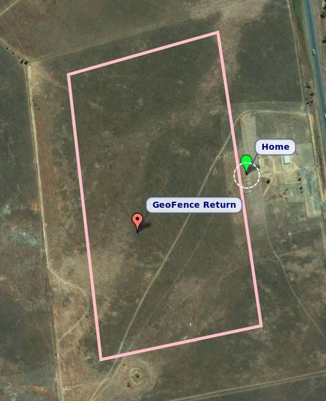

# Coğrafi Sınırlandırma

GPS konumlarının kapalı bir poligonu artı minimum ve maximum irtifa olarak uçmak istenilen alan etrafına sanal bir "çit" yapmanıza izin verir.

Çalışması için çizilmiş bir çit poligonunun olması GEREKİR. 

Çit etkin olduğunda, uçağınız çitle çevrili alanın dışına çıkarsa, GUIDED moduna geçer ve önceden tanımlanmış bir noktaya döner ve tekrar ele geçirmeniz için loiter yapar. Daha sonra kumandanızla veya YKİ ile kontrolü geri alın.

## R/C Eğitimi İçin Kullanmak

Kumanda eğitimi için bir alan çevirip güvenle uçuş yapabilirsiniz.

Coğrafi sınırlandırma, herhangi APM uçuş moduyla birleştirilebilir. Manuel modla birleştirirseniz yalnızca çitle çevrili alanın dışına veya irtifa aralığının dışına çıakrsanız kontrol altına alır.

## Sınırlama İçin Kullanma

Tamamen otonom uçuş sırasında, emniyet önlemi olarak kullanılabilir. Bunun için FENCE_AUTOENABLE parametresini kullanın; uçak kalkış tamamlandıktan sonra otomatik olarak çiti çalıştırır ve iniş noktasına ulaşıldıında çiti otomatik olarak devre dışı bırakır. Bu öze lliği kullanmak için FENCE_AUTOENABLE parametresini 1 olarak ayarlayın. 

Yarı otonom uçuşlarda ise çit YKİ veya kumanda üzerinden etkinleştirebilir/devre dışı bırakılabilir - bu durumda FENCE_AUTOENABLE isteğe bağlıdır.

## Coğrafi Sınırlandırma Oluşturmak

Coğrafi çit oluşturmak için birkaç şey yapılandırmanız gerekir:

1. çit sınırı, GPS noktaları kümesi olarak
2. çit ihlalinde yapılacak eylem
3. dönüş noktası konumu; isteğe bağlı olarak uçağın çit dönüş noktası yerine en yakın Rally noktasına dönmesi için FENCE_RET_RALLY parametresini kullanabileceğinizi unutmayın.
4. çitle çevrili alanın min ve maks irtifası
5. coğrafi sınırlandırmayı etkinleştirmek için kullanılacak RC kanalı (varsa)
6. sınırlandırmayı otokalkıştan sonra otomatik olarak etkinleştirecek ve otoiniş sonrası otomatik olarak devre dışı bırakacak şekilde yapılandırmak istediğinizde isteğe bağlı bir ayar (FENCE_AUTOENABLE)
7. sınır ihlali sırasında kontrolün nasıl geri alınacağı

Çit sınırızı oluştururken uymanız gereken birkaç kural vardır:

1.
2.
3.
